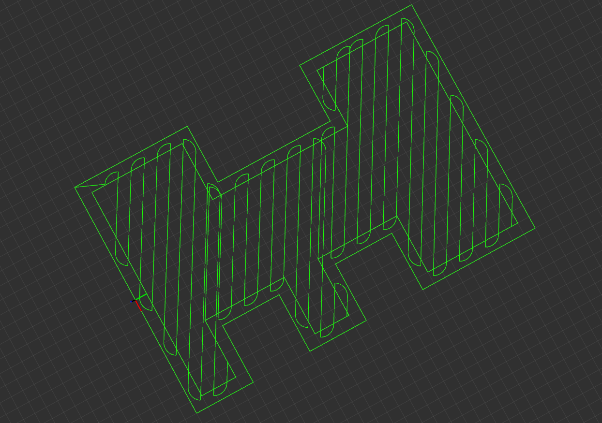

# Boustrophedon Planner
Boustrophedon Planner is a coverage path planner that implements a modified cellular decomposition algorithm. The original can be found [here](https://www.ncbi.nlm.nih.gov/pmc/articles/PMC6806237/).

## Overview
The path planner is an actionlib server that takes in a `geometry_msgs/PolygonStamped` and a `geometry_msgs/PoseStamped`,
and returns a `StripingPlan` message which contains a list of waypoints to stripe the passed in polygon.

## Changelog

- January 23, 2020:
  - The boustrophedon planner can now handle all types of simple polygons that it is given, both convex and concave.
  - Inner boundaries are supported, allowing the planner to create paths at a certain offset from the initial given boundary.
  - "Half - Y" turns are supported, allowing for some curvature at the start / end of paths to assist robots that are not      completely holonomic.
  - Many new launch file parameters allow the user to specify more precisely the behavior that they want the plan to have

## License

This library is released under the [MIT License](https://opensource.org/licenses/MIT) by [Greenzie](https://www.greenzie.com/). See License for full details.
